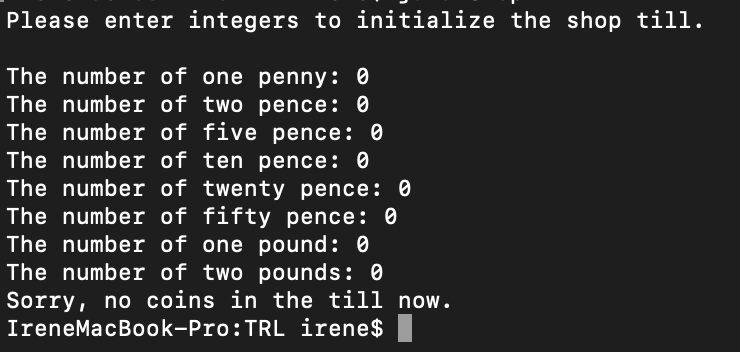
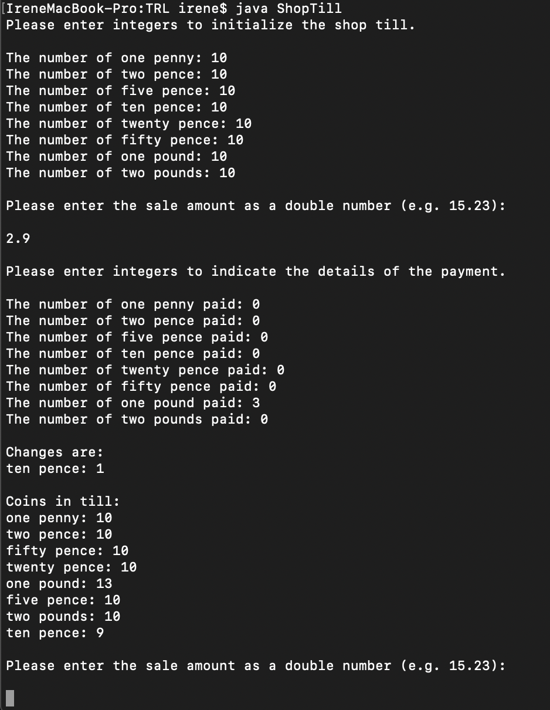
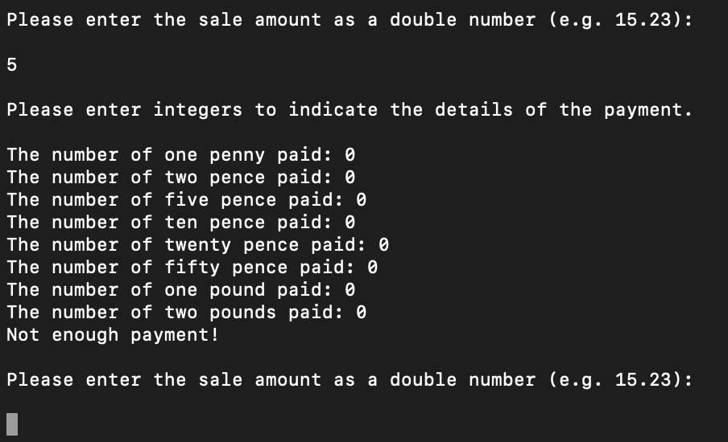
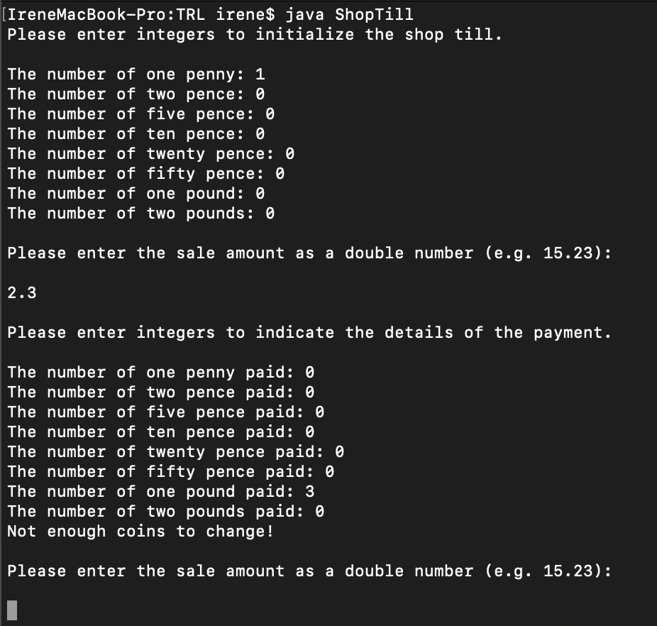

# Shop Till Instruction
This function simulates a simple shop till which only accept coins (one penny, two pence, five pence, ten pence, twenty pence, fifty pence, one pound, two pounds). The shop till will first take the payment from the customer, then make a change.
Details can be found in `ShopTill.java`, where `initialise_till()` is the method used to 
initialise the till; `initialise_payment()` is the method use to initialise the payment; `get_changes()` is the method used to calculate the changes.

To achieve this function:

- Firstly, the customer need to input eight integers which indicates the number of different coins in the till.
- Secondly, the customer need to input a double number to indicate the sale amount.
- Then, the customer need to input eight integers which indicates the number of different coins paid by the customer.
- Finally, the corresponding changes will be given based on the input information. (Note that the details of changes will show only if there are changes need to give, for example, if the payment is equal to the sale amount, then there will be no changes.)

There are four conditions that the current trade will be canceled, and corresponding message will pop up:
1. The payment from the customer is not enough.
2. There are not enough required types of coins in the till.
3. There are not enough money in the till (changes are greater than the money in the till, normally this will not happen since the shop till will first take the payment from the customer.).
If the current trade was canceled, the next trade will start (input a new payment details).

There is one situation that the shop till will be closed, which is the till is emputy (no coins in the till), 
as shown in below sample output:

Sample output of the normal situation:

Sample output of trade cancellation - condition 1:

Sample output of trade cancellation - condition 2:

## Steps to run the function
  1. run `javac ShopTill.java`
  2. run `java ShopTill`